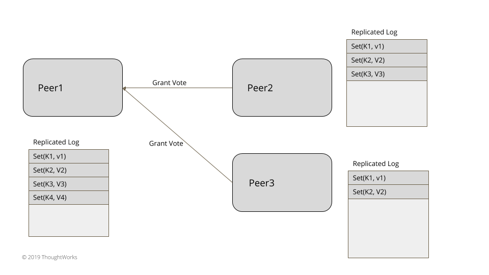
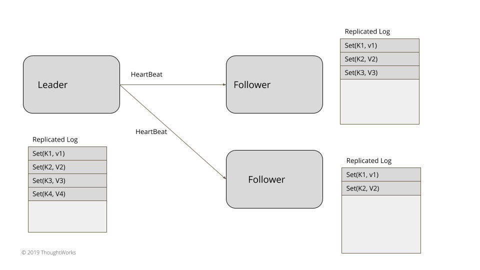
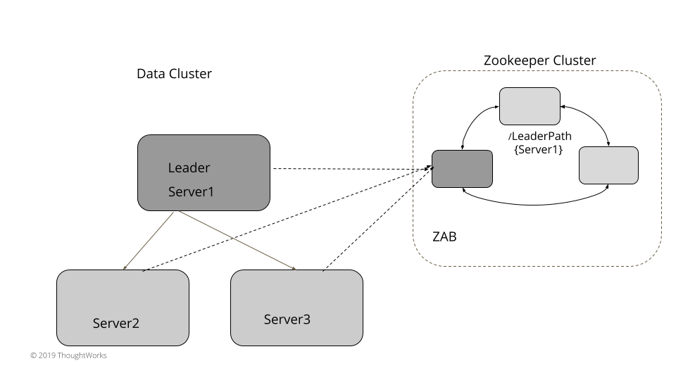
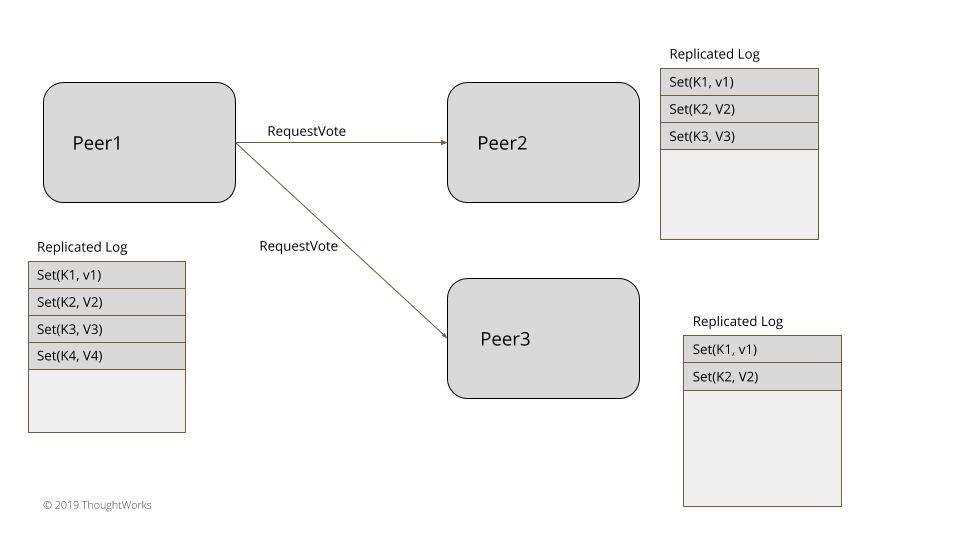

# 领导者和追随者 (Leader and Followers)

原文: https://martinfowler.com/articles/patterns-of-distributed-systems/leader-follower.html

有一台服务器来协调一组服务器之间的数据复制。
# 问题
为了在管理数据的系统中实现容错，需要在多台服务器上复制数据。

给客户提供一些关于一致性的保证也很重要。当数据在多个服务器上更新时，需要决定什么时候让客户可见。写投票数和读投票数是不够的，因为一些故障场景会导致客户端看到的数据不一致。每个单独的服务器都不知道其他服务器上的数据状态，只有从多个服务器上读取数据时，才能解决不一致的问题。在某些情况下，这还不够。需要对发送到客户端的数据提供更有力的保证。

# 解决方案

在集群中选择一台服务器作为领导者。领导者负责代表整个集群进行决策，并将决策传播给所有其他服务器。

每个服务器在启动时都会寻找一个现有的领导者。如果没有找到领导者，就会触发领导者选举。服务器只有在领导者被成功选择后才会接受请求。只有领导者才会处理客户端的请求。如果一个请求被发送到一个跟随者服务器，跟随者可以将其转发给领导者服务器。

## 领导者选举



Figure 1: Election



Figure 2: Votes



Figure 3: Leader Heartbeats

对于三到五个节点的小型集群，比如在实现共识的系统中，领导者选举可以在数据集群本身中实现，而不依赖于任何外部系统。领导者选举发生在服务器启动时。每台服务器在启动时都会启动领导者选举，并尝试选出一个领导者。除非选举出一个领导者，否则系统不接受任何客户端请求。正如在生成时钟模式中所解释的那样，每次领导者选举还需要更新生成时钟。服务器可以始终处于领导者、追随者或寻找领导者（或候选人）这三种状态中的一种。

```java
public enum ServerRole {
    LOOKING_FOR_LEADER,
    FOLLOWING,
    LEADING;
}
```

HeartBeat机制用于检测现有领导人是否失败，以便开始新的领导人选举。

新的领导人选举是通过向每个对等服务器发送请求投票的消息开始的。

```java
class ReplicationModule…

  private void startLeaderElection() {
      replicationState.setGeneration(replicationState.getGeneration() + 1);
      registerSelfVote();
      requestVoteFrom(followers);
  }
```

## 选举算法

在选举领导人时要考虑两个因素:

- 因为这些系统主要是用于数据复制，所以对哪些服务器可以赢得选举做出了一些额外的限制。只有 "最新 "的服务器才能成为合法的领导者。例如，在典型的基于共识的系统中，"最新 "是由两件事定义的。
    - 最新的生成时钟
    - 最新的写前日志(Write-Ahead Log)
- 如果所有的服务器都是最新的，那么根据以下标准选择领导者:
    - 一些特定的实现标准，比如哪个服务器的排名比较好或者id比较高。(例如：Zab)
    - 如果要确保每次只有一台服务器要求投票，那么哪一个服务器比其他服务器先开始选举。(如Raft)

一旦一个服务器在一个特定的生成时钟中被投票，该时钟的投票就会被返回。这确保了当一个成功的选举已经发生时，其他服务器请求为同一时钟投票的服务器不会当选。投票请求的处理过程如下。

```java
class ReplicationModule…

  VoteResponse handleVoteRequest(VoteRequest voteRequest) {
      VoteTracker voteTracker = replicationState.getVoteTracker();
      Long requestGeneration = voteRequest.getGeneration();
      if (replicationState.getGeneration() > requestGeneration) {
          return rejectVote();

      } else if (replicationState.getGeneration() < requestGeneration) {
          becomeFollower(requestGeneration);
          voteTracker.registerVote(voteRequest.getServerId());
          return grantVote();
      }

      return handleVoteRequestForSameGeneration(voteRequest);
  }

  private VoteResponse handleVoteRequestForSameGeneration(VoteRequest voteRequest) {
      Long requestGeneration = voteRequest.getGeneration();
      VoteTracker voteTracker = replicationState.getVoteTracker();

      if (voteTracker.alreadyVoted()) {
          return voteTracker.grantedVoteForSameServer(voteRequest.getServerId()) ?
                  grantVote():rejectVote();

      }

      if (voteRequest.getLogIndex() >= (Long) wal.getLastLogEntryId()) {
          becomeFollower(requestGeneration);
          voteTracker.registerVote(voteRequest.getServerId());
          return grantVote();
      }

      return rejectVote();
  }

  private void becomeFollower(Long generation) {
      replicationState.setGeneration(generation);
      transitionTo(ServerRole.FOLLOWING);
  }

  private VoteResponse grantVote() {
      return VoteResponse.granted(serverId(),
              replicationState.getGeneration(),
              wal.getLastLogEntryId());
  }

  private VoteResponse rejectVote() {
      return VoteResponse.rejected(serverId(),
              replicationState.getGeneration(),
              wal.getLastLogEntryId());
  }
```

获得大多数服务器投票的服务器，转入领导者状态。多数票的确定，如在Quorum中讨论的那样。一旦当选，领导者将持续向所有的追随者发送心跳（HeartBeat）。如果追随者在指定的时间间隔内没有收到心跳，就会触发新的领袖选举。

## 使用外部存储[可线性化]进行领导人选举

在数据集群内运行领导者选举对于小型集群来说效果很好，但对于大型数据集群来说，可以达到几千个节点，使用Zookeeper或etcd等外部存储比较容易(它们内部使用共识并提供线性化保证)。这些大型集群通常有一个服务器，它被标记为主节点或控制器节点，代表整个集群做出所有的决策。实现领导者选举需要有三个功能。

- 比较和交换（compareAndSwap）指令，用于自动设置Key
- 如果未从当选的领导者收到任何心跳信号，则将使用的Key过期，从而触发新的选举。
- 一种通知机制，用于在Key过期时通知所有感兴趣的服务器

对于选举领导者，每个服务器使用compareAndSwap指令尝试在外部存储中创建一个Key，哪个服务器先成功，就当选为领导者。根据使用的外部存储，密钥的创建有一个小的存活时间。当选的领导者需要在生存周期内反复更新Key。每个服务器都可以为这个key设置一个监听，如果key过期而没有在设置的生存时间内得到现有leader的更新，服务器就会得到通知。例如，etcd允许compareAndSwap操作，只有当key之前不存在时才允许设置key操作。在Zookeeper中，没有显式的compareAndSwap类操作支持，但可以通过尝试创建一个节点来实现，如果节点已经存在，则抛出一个异常。也没有明确的存活时间，但是zookeeper有一个临时节点的概念。在服务器与zookeeper有一个活跃的会话之前，这个节点都会存在，否则这个节点就会被删除，并且会通知所有正在监听这个节点的人。例如，Zookeeper可以用来选举领袖，如下所示。

```java
class ServerImpl…

  public void startup() {
      zookeeperClient.subscribeLeaderChangeListener(this);
      elect();
  }

  public void elect() {
      var leaderId = serverId;
      try {
          zookeeperClient.tryCreatingLeaderPath(leaderId);
          this.currentLeader = serverId;
          onBecomingLeader();
      } catch (ZkNodeExistsException e) {
          //back off
          this.currentLeader = zookeeperClient.getLeaderId();
      }
  }
```

所有其他服务器都会观察现有领袖的状态。当检测到现有的领导者失效时，就会触发一个新的领导者选举。失败检测是通过使用相同的外部可线性化存储来进行的，该存储用于领导者选举。这个外部存储也有实现组成员和失败检测机制的设施。例如，扩展上述基于Zookeeper的实现，可以用Zookeeper配置一个变化监听器，当现有leader节点发生变化时，该监听器会被触发。

```java
class ZookeeperClient…

  public void subscribeLeaderChangeListener(IZkDataListener listener) {
      zkClient.subscribeDataChanges(LeaderPath, listener);
  }
```

集群中的每一台服务器都会订阅这个变化，每当回调被触发时，新的选举就会再次被触发，方法同上图。

```java
class ServerImpl…

  @Override
  public void handleDataDeleted(String dataPath) throws Exception {
      elect();
  }
```



Figure 4: Zookeeper Based Election

像etcd或Consul这样的系统也可以用同样的方式来实现领导者选举。

## 为什么 Quorum read/writes 不足以实现强一致性保证？

- 最小读票数（read quorum）
- 最小写票数（write quorum）

看上去，Cassandra等Dynamo风格的数据库提供的Quorum读写功能，足以在服务器故障的情况下获得强大的一致性。但事实并非如此。考虑下面的例子。假设我们有一个有三台服务器的集群。变量x存储在三台服务器上。它的复制系数为3）。启动时x的值=1。

- 假设writer1写入x=2，复制因子为3，写入请求被发送到三个服务器上。写入在server1上成功，但server2和server3却失败了（可能是网络故障，也可能是writer1在向server1发送写入请求后进入了长时间的垃圾收集暂停）
- 客户端c1从server1和server2读取x的值。它得到最新的x=2的值，因为server1有最新的值。
- 客户端c2触发了对x的读取，但是server1暂时宕机了。于是c1从server2、server3读取，这两个服务器的x有旧值，x=1。所以c2即使在c1读到最新值后再读，也会得到旧值。

这样连续两次读取都会显示最新值消失了。一旦server1重新启动，后续的读数就会给出最新的值。假设修复进程运行了，其他服务器也会 "最终 "得到最新的值。但存储集群没有提供任何保证，确保一旦某个值对任何客户端可见，即使服务器出现故障，所有后续的读取也会继续得到该值。

# 示例

- 对于实现共识的系统来说，只有一台服务器协调复制过程的活动是很重要的。正如《Paxos Made Simple》一文中所指出的那样，这对系统的生命力很重要。
- 在Raft和Zab共识算法中，领导者选举是一个明确的阶段，它发生在启动时或领导者失败时。
- Viewstamp Replication算法有一个Primary的概念，类似于其他算法中的leader。
- Kafka有一个Controller，它负责代表集群的其他部分做出所有的决定。它对来自Zookeeper的事件做出反应，对于Kafka中的每个分区，都有一个指定的leader broker和follower broker。领导者和跟随者的选择是由Controller broker完成的。